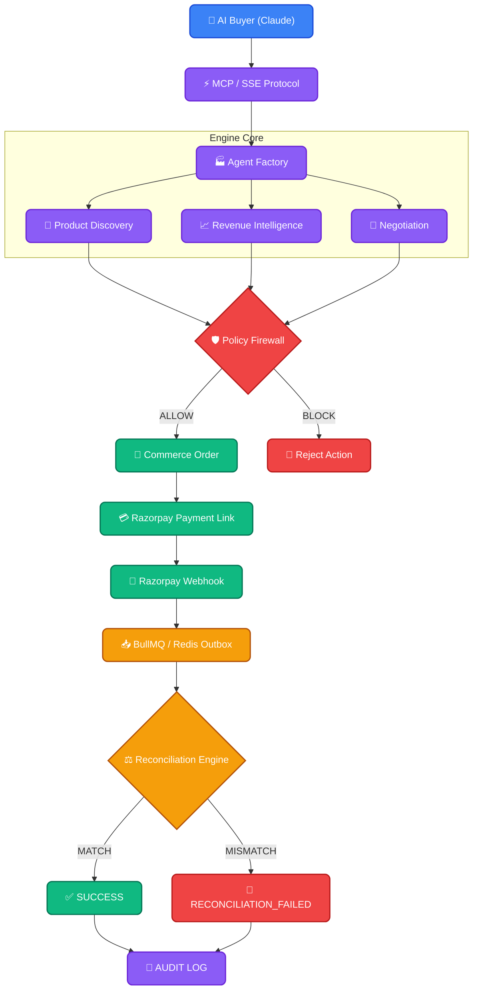
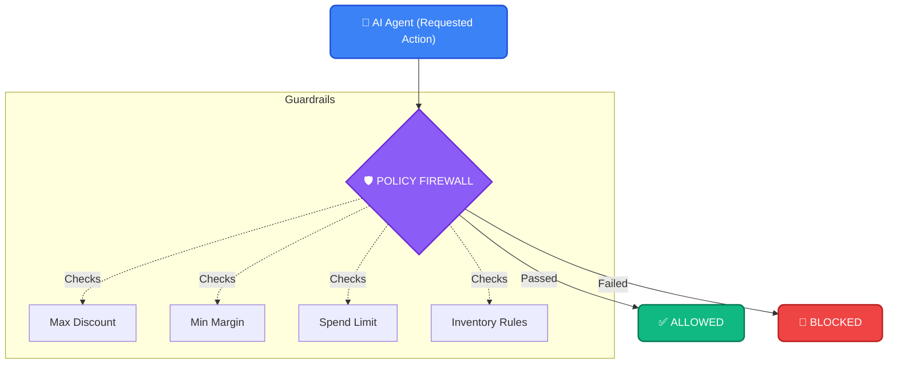
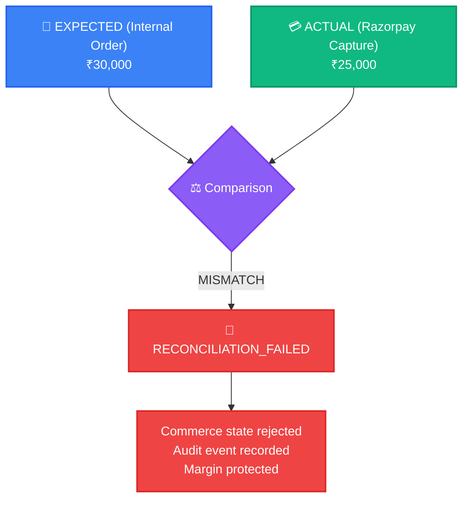

# Agentic Commerce 

> **AI Buyer → Merchant Revenue → Razorpay**

*We didn't build a chatbot that can recommend a product. We built the merchant-side infrastructure that lets an AI buyer actually do business with a merchant — while keeping revenue decisions explainable, financial actions bounded, and payment state independently verifiable.*

[🎥 5-Min Demo](#) | [🏗 Architecture](docs/ARCHITECTURE.md) | [🚀 Quick Start](#-quick-start)

---

## What is this?

AI is becoming a new interface for commerce, but traditional merchants are not built to transact securely with AI buyers.

A merchant may have a catalog, inventory, and payment gateway, but an external AI agent still needs a safe way to discover products, understand availability, optimize the basket, negotiate within merchant policy, obtain human approval, and complete a real payment. 

Agentic Commerce gives merchants an AI-facing revenue layer. **The agent isn't only a checkout interface; it is a revenue channel.**

An external AI buyer (like Claude) connects to our merchant through the Model Context Protocol (MCP). The merchant agent exposes real catalog and inventory data, evaluates revenue opportunities (cross-sell/upsell), negotiates within deterministic merchant policies, and generates a secure Razorpay Payment Link only after the required approval boundary is satisfied. 

---

### Built for
**Razorpay AI Buildathon 2026 — Track 01: AI Growth & Agentic Commerce**

## Razorpay Buildathon — Track 01 Alignment

| Requirement | Implementation |
| :--- | :--- |
| **AI buyer** | MCP-compatible external AI client (Claude) |
| **Agent-readable catalog** | Exposed via MCP commerce tools |
| **Revenue growth** | Cross-sell / upsell logic engine |
| **Negotiation** | Bounded by merchant policy engine |
| **Bounded money action** | Policy firewall |
| **Razorpay payment** | Payment Links API & Webhooks |
| **Explainable transaction** | Agent decision + audit log UI |
| **Financial verification** | Asynchronous webhook reconciliation |
| **Failure handling** | `RECONCILIATION_FAILED` trace |

---

## 📖 Complete Documentation Directory
* [Architecture Overview](docs/ARCHITECTURE.md)
* [Tech Stack & Repository Map](docs/tech.md)
* [Security & Threat Model](SECURITY.md)
* [AI Judgment & Boundaries](docs/AI-JUDGMENT.md)
* [Failure Recovery (What Broke)](docs/FAILURE-RECOVERY.md)
* [Engineering Decisions](docs/DECISIONS.md)
* [Live Demo Reproduction](docs/DEMO.md)

---

## The Architecture Flow



## Core Technical Idea

**Let the AI reason. Never let the AI become the financial authority.**

The external AI determines buyer intent and requests actions through MCP. Our backend remains strictly authoritative for:
- Product identity and prices
- Revenue opportunities
- Negotiation limits
- Order amounts
- Payment identity and reconciliation

This creates a deterministic financial boundary around a probabilistic AI system. The AI can say, *"The buyer wants 5 watches and a better price."* But it cannot decide, *"The product costs ₹X, the discount is Y%, and Razorpay received ₹Z."* 

Those facts are resolved and validated by the backend. After Razorpay reports the payment, we independently verify: **Internal Order Amount = Captured Payment Amount**. Only when the backend confirms the invariant do we expose the transaction as successfully reconciled.

---

## Two Demo Journeys

### 1. Merchant Onboarding (The Agent Factory)
```text
Create merchant → Connect catalog → Configure inventory → Define margin policy → Define discount policy → AI-ready merchant
```

### 2. AI Buyer (The Transaction)
```text
Buyer intent → Product discovery → Revenue opportunity → Negotiation → Policy evaluation → Razorpay Payment Link → Webhook → Reconciliation → Audit
```

---

## Revenue Engine

This project doesn't just sell items; it actively grows revenue using multi-model AI orchestration.

* **Cross-sell:** Recommends add-ons (e.g., suggesting socks when a user buys Air Force 1s).
* **Upsell:** Identifies when a buyer might want a premium tier.
* **Negotiation:** Dynamically closes sales by offering structured discounts.

*(All interactions are evaluated deterministically to ensure positive ROI for the merchant).*

---

## Deterministic Policy Firewall ⭐

> **The AI proposes. The policy engine disposes.**



---

## AI Judgment ⭐

We strictly separate probabilistic intelligence from deterministic financial state.

| AI handles | Backend handles |
| :--- | :--- |
| Intent understanding | Price validation |
| Product recommendation | Inventory allocation |
| Revenue opportunity | Discount limits |
| Negotiation | Margin constraints |
| Tool selection | Payment state |
| Natural-language interaction | Reconciliation |

---

## Payment Architecture

```text
Commerce Order → Razorpay Checkout → Payment Captured → Webhook → Persist Event → BullMQ → Reconciliation
```
We process webhooks via a Redis-backed Outbox pattern. This guarantees idempotency, fault tolerance, and ensures that financial reconciliation is handled defensively.

---

## Failure Recovery ⭐⭐⭐

AI is non-deterministic. What happens if the AI hallucinates a discount, or a user modifies the Razorpay client script to pay less?



Our asynchronous reconciliation worker compares the Razorpay capture to the internal state. If it mismatches, it halts the order. **This directly answers the Buildathon requirement to show a failure handled gracefully.**

---

## Security Boundaries

The LLM does not directly control financial state. Financial actions are constrained by explicit MCP tool boundaries, merchant policies, and asynchronous webhook reconciliation.

**[Read the security model →](SECURITY.md)**

---

## 🚀 Quick Start

**Note: This runs in Test Mode only.**

```bash
git clone https://github.com/your-username/agentic-commerce.git
cd agentic-commerce

# Install dependencies
npm install
cd frontend && npm install && cd ..

# Setup environments
cp .env.example .env
# Ensure DATABASE_URL and RAZORPAY_KEY_ID are set

# Start Backend & MCP Server
npm run dev

# Start Frontend (in a new terminal)
cd frontend
npm run dev
```

* Frontend → `http://localhost:3000`
* Backend → `http://localhost:3001`

---

## Tech Stack

**Frontend:** Next.js, Tailwind, React Query
**Backend:** Node.js, Express, TypeScript
**AI Interface:** Anthropic Model Context Protocol (MCP SDK), Vercel AI SDK
**Data & Queue:** Prisma (PostgreSQL/SQLite), Redis, BullMQ
**Payments:** Razorpay Payment Links API, Razorpay Webhooks


---

## Repository Structure

```text
.
├── frontend/             # Next.js Merchant Dashboard (Agent Factory)
├── src/
│   ├── api/mcp/          # Model Context Protocol tools & SSE server
│   ├── modules/          # Commerce, Policy Firewall, Negotiation logic
│   └── infrastructure/   # BullMQ Outbox, Razorpay Webhooks, AI Routing
├── prisma/               # Database schema for Guardrails and Audits
├── skills/               # Modular schemas preventing AI hallucination
├── docs/                 # Architecture, AI Judgment docs
└── SECURITY.md           # Root-level vulnerability and security policy
```

---

## GitHub Security Status

As a platform handling financial negotiations, we prioritize code security. This repository uses GitHub's native security features to ensure safety and transparency for merchants.

```text
GitHub Security Checks
✓ No exposed secrets (Secret Scanning enabled)
✓ Dependency alerts enabled (Dependabot)
✓ Push protection active
✓ Code scanning configured
```

---

## Known Limitations
* The current AI buyer is demonstrated through an external MCP client (Claude Desktop).
* Razorpay integration runs purely in test mode.
* The Outbox pattern requires a running Redis instance to process webhooks.
