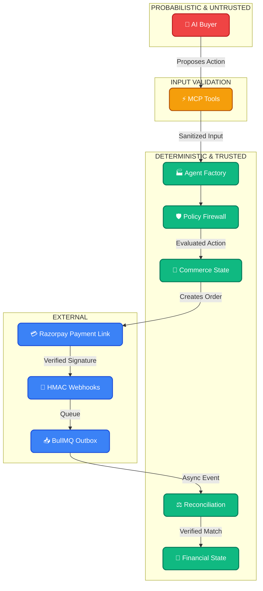
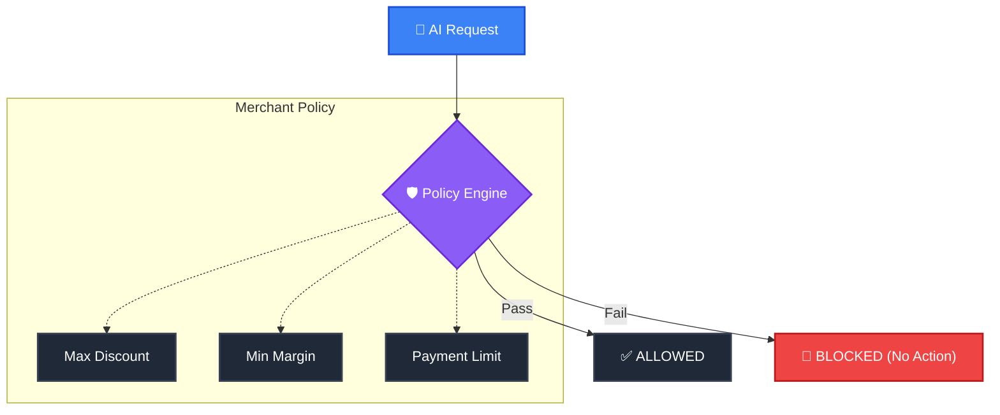
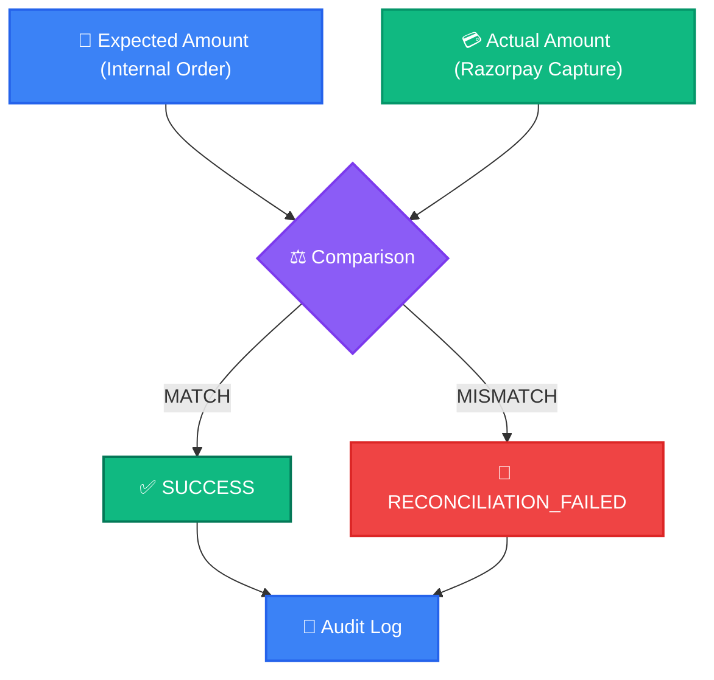

# Agentic Commerce Security Architecture

This document outlines the security architecture and threat model for the Agentic Commerce platform. Unlike traditional commerce, our threat vector includes non-deterministic AI agents negotiating financial state. 

Therefore, our core security principle is: **The AI is not a trusted authority over financial state.**

---

## 1. Trust Boundaries



---

## 2. Razorpay Security Requirements

Razorpay emphasizes strict controls for API usage and webhooks. Our implementation explicitly implements these safeguards:

| Security requirement | Our control |
| :--- | :--- |
| **Secret protection** | `.env` variables, never committed to version control. |
| **Webhook authenticity** | HMAC-SHA256 signature verification. |
| **Duplicate events** | `WebhookEvent` database table with `eventId` unique constraints. |
| **Replay/duplicate processing** | Idempotent Outbox pattern via Redis + BullMQ. |
| **Payment amount** | Passed directly from the deterministic backend, bypassing the LLM. |
| **Async processing** | Webhooks immediately acknowledged, then processed by BullMQ workers. |
| **Financial correctness** | Asynchronous Reconciliation Engine (`reconciliation.ts`). |

---

## 3. AI Security & The Policy Firewall

**Threats:**
* AI might hallucinate a price.
* AI might request an excessive discount.
* AI might attempt to sell an out-of-stock product.

**Security Principle:**
`AI proposes → Backend validates → Policy evaluates → Financial system executes`

We do not let the AI connect directly to Razorpay. Instead, it interacts with our **Policy Firewall**:



When an AI requests checkout, the Policy Engine evaluates the request. If the request violates the bounds, it is **BLOCKED**, and no financial action is initiated.

---

## 4. Payment & Browser Security

**The Browser is not the source of truth.**

If a user modifies the client-side Razorpay Javascript to pay ₹100 instead of ₹10,000, our system catches it.

```text
Browser → Razorpay Payment Link → Razorpay → Webhook → Backend verification → Reconciliation → Financial state
```

The database is never updated to `PAID` just because the frontend reports success. True financial state is only committed after the Razorpay webhook arrives and passes our reconciliation checks.

---

## 5. Duplicate Webhook Protection

Razorpay explicitly warns that duplicate webhook events can occur.

```mermaid
graph TD
    classDef default fill:#1f2937,stroke:#374151,stroke-width:2px,color:#fff;
    classDef warning fill:#f59e0b,stroke:#b45309,stroke-width:2px,color:#fff;
    classDef success fill:#10b981,stroke:#047857,stroke-width:2px,color:#fff;
    classDef req fill:#3b82f6,stroke:#1d4ed8,stroke-width:2px,color:#fff;
    
    A["🔔 Webhook"]:::req --> B["🆔 Extract Event ID"]
    B --> C{"Check DB for Event ID"}
    
    C -->|YES (Duplicate)| D["🚫 Ignore (Idempotent)"]:::warning
    C -->|NO (New)| E["💾 Persist to Outbox"]:::success
    E --> F["⚙️ Process Worker"]:::success
```
Our `WebhookEvent` table enforces a strict unique constraint on `providerEventId`. This completely mitigates duplicate webhook processing.

---

## 6. Failure Security (Reconciliation)

What happens when an anomaly slips through?



**Financial state is committed only after the transaction passes the required verification and reconciliation checks.** If there is a mismatch, the order is halted and flagged in the Audit logs.

---

## 7. Secrets Management

The following API secrets are strictly excluded from version control via `.gitignore`:
* `RAZORPAY_KEY_SECRET`
* `RAZORPAY_WEBHOOK_SECRET`
* `DATABASE_URL`
* `REDIS_URL`
* `OPENAI_API_KEY`
* `GROQ_API_KEY`

Reference `.env.example` for the required configuration template.

---

## 8. Known Limitations

* The AI buyer currently operates through an external MCP client.
* Razorpay integration is demonstrated in Test Mode only.
* Financial reconciliation protects the commerce state *after* webhook processing; it halts fulfillment, but it does not currently trigger an automated Razorpay API refund (refunds must be manual).

---

## 9. Vulnerability Reporting

Please do not disclose security vulnerabilities through public GitHub issues or pull requests.

Report security issues privately by contacting the repository maintainer directly.

Please include:
- Affected component
- Reproduction steps
- Expected behavior
- Observed behavior
- Potential impact
