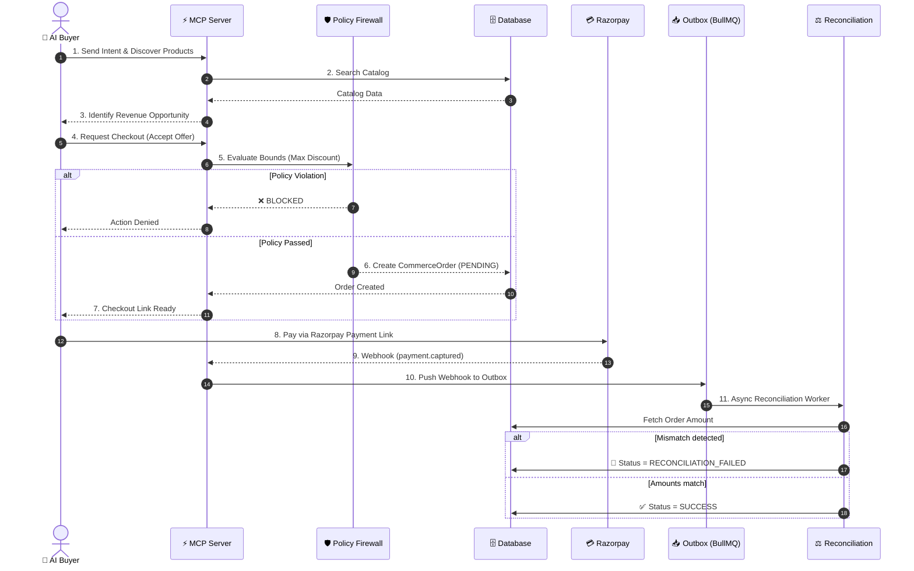

# Architecture

## Request Lifecycle

1. **AI sends intent:** The user tells Claude to buy an item.
2. **MCP exposes capabilities:** Claude connects to our MCP server and sees available merchant tools.
3. **Agent searches catalog:** Claude calls `merchant.search_products` to find the exact ID and price.
4. **Revenue engine identifies opportunity:** The system logs an upsell/negotiation opportunity.
5. **Policy evaluates action:** Claude requests checkout via `merchant.accept_offer`. The backend Policy Firewall verifies the requested price doesn't violate the merchant's margin bounds.
6. **Order created:** The database creates a `CommerceOrder` in `PENDING` state.
7. **Razorpay Checkout:** The user opens the dynamic `/pay` link and completes the transaction in the Razorpay UI.
8. **Webhook received:** Razorpay sends the success webhook to our `/v1/webhooks/razorpay` endpoint.
9. **Outbox event persisted:** Instead of processing synchronously, the webhook is pushed to the BullMQ outbox for idempotency.
10. **Worker reconciles:** The `reconciliation.ts` worker compares the Razorpay capture amount to the internal `CommerceOrder` total.
11. **Audit event recorded:** The final result (`SUCCESS` or `RECONCILIATION_FAILED`) is logged to the database and displayed in the frontend Audit UI.
